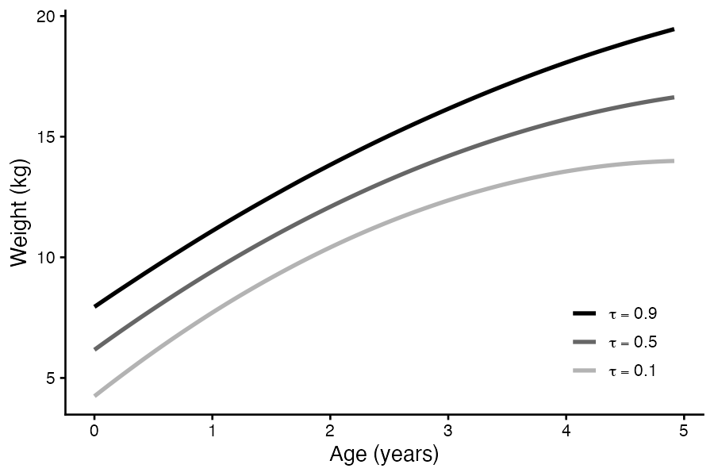
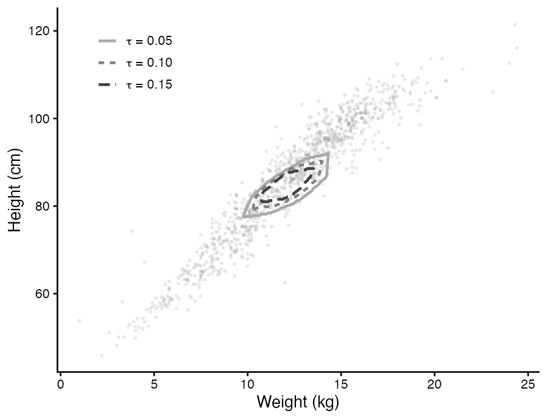

# bayesQRsurvey

[](https://CRAN.R-project.org/package=bayesQRsurvey)
[](LICENSE)

Bayesian quantile regression for complex survey data collected under
informative sampling, where the probability of selection is related to the
response and ignoring it biases the estimates. The survey weights enter the
working likelihood directly, so the sampling design is accounted for in the
posterior rather than through a subsequent correction.

The package covers models with a **single** response, sampled by MCMC, and
models with a **vector** response, fitted by an EM algorithm, where a quantile
is a nested family of convex regions rather than a curve. All core routines
are written in C++, so a standard analysis runs in a few seconds.

## Installation

```r
install.packages("bayesQRsurvey")

# development version
remotes::install_github("torodriguezt/bayesQRsurvey")
```

## Single-output models

The examples below use `Anthro`, a survey of 985 children with the sampling
weight in `dweight`. Weight is modelled as a quadratic function of age,
adjusting for sex, at three quantile levels.

```r
library("bayesQRsurvey")

data("Anthro", package = "bayesQRsurvey")
Anthro$age <- Anthro$age / 12
Anthro$sex <- factor(Anthro$sex, levels = c("1", "0"),
                     labels = c("Boys", "Girls"))

set.seed(50)
fit <- bqr.svy(wgt ~ age + I(age^2) + sex, weights = dweight,
               data = Anthro, quantile = c(0.1, 0.5, 0.9),
               niter = 20000, burnin = 10000, thin = 1)

print(summary(fit), tau = 0.5)
#> Method: ald
#> Quantiles: 0.500
#>
#> == tau=0.500 ==
#>   Draws: 10000 | Warmup: 10000 | Thin: 1
#>
#>     variable   mean lower_ci upper_ci
#>  (Intercept)  6.168    5.818    6.516
#>          age  3.538    3.196    3.888
#>     I(age^2) -0.287   -0.359   -0.217
#>     sexGirls -0.587   -0.814   -0.370
```

Three working likelihoods are available through `method`: `"ald"`, based on
the asymmetric Laplace distribution, which is the default and the fastest;
and `"score"` and `"approximate"`, which build a design-based variance into
the likelihood itself.

The `plot()` method draws fitted quantile curves, trace plots, posterior
densities and coefficient profiles across quantile levels, selected through
`type`.

```r
plot(fit, type = "fit", which = "age")
```



## Multiple-output models

With two responses the quantile is a region. The responses are bound on the
left-hand side of the formula, and the directions used to build the region
are generated according to `n_dir`.

```r
set.seed(50)
fit_mo <- mo.bqr.svy(cbind(wgt, hgt) ~ age + I(age^2) + sex,
                     weights = dweight, data = Anthro,
                     quantile = c(0.05, 0.10, 0.15),
                     n_dir = 20, max_iter = 2000)

print(summary(fit_mo), coefficients = FALSE)
#>   Multiple-Output Bayesian Quantile Regression (Summary)
#>   --------------------------------------------------------
#>   Quantiles  : 0.050, 0.100, 0.150
#>   Directions : 20
#>   Sample     : 985 obs, 2 responses
#>   Estimation : EM (posterior mode / MAP)
#>   --------------------------------------------------------
#>
#>   EM convergence by magnitude (iterations: min / median / max)
#>
#>    tau converged        iterations sigma
#>  0.050     20/20 76 / 149.5 / 1252     1
#>  0.100     20/20  64 / 140.5 / 580     1
#>  0.150     20/20    49 / 163 / 345     1
```

`plotQuantileRegion()` intersects the directional half-spaces for a chosen
covariate profile, here a two-year-old boy, and draws the resulting contours
over the observed responses. The regions are nested and convex, and are read
from the outside in.

```r
plotQuantileRegion(fit_mo, response = c("wgt", "hgt"), datafile = Anthro,
                   xValue = c(1, 2, 4, 0), paintedArea = FALSE)
```



## Learn more

`vignette("bayesQRsurvey")` gives a longer tour of both model families,
including priors, convergence diagnostics and the remaining estimation
methods.

## References

Nascimento ML, Gonçalves KCM (2024). "Bayesian Quantile Regression Models for
Complex Survey Data Under Informative Sampling." *Journal of Survey Statistics
and Methodology*, **12**(4), 1105–1130.
[doi:10.1093/jssam/smae015](https://doi.org/10.1093/jssam/smae015)

## Authors

- **Tomás Rodríguez Taborda**, Universidad Nacional de Colombia
- **Johnatan Cardona Jiménez**, Universidad Nacional de Colombia
- **Marcus L. Nascimento**, Getulio Vargas Foundation (FGV EMAp)
- **Kelly Cristina Mota Gonçalves**, Federal University of Rio de Janeiro

## License

MIT
